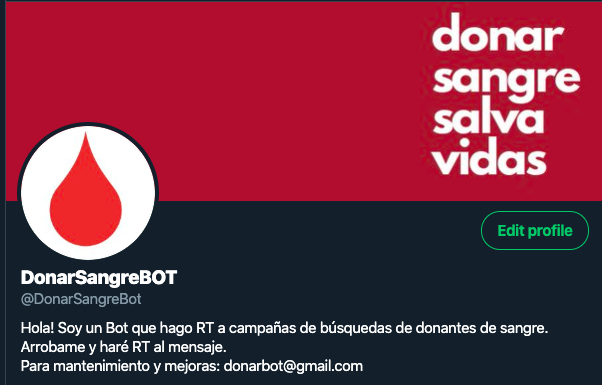

# @DonarSangreBot - Bot de Difusión de Campañas de Donación de Sangre

En este repositorio podes encontrar las lineas que dan vida al Bot [@DonarSangreBot](www.twitter.com/DonarSangreBot).

Si todavía no lo seguis, te invito a que lo hagas y en caso que quieras difundir alguna campaña sólo tenes que arrobarlo en un tweet, respuesta a un tweet o si citas el tweet de la campaña, mencionándolo en la cita.

**Nuevo:** Encuentra búsquedas de dadores y hace RT.

## Objetivo
### Primario
El objetivo del Bot es difundir campañas de dadores o donantes de sangre para que lleguen a más personas que quieran ayudar. Otro objetivo, es convertir el Timeline (TL) del Bot en un lugar para centralizar las búsquedas.

### Secundario
Practicar habilidades de programación en Python armando algo de valor para la comunidad.

## Next Steps (próximas iteraciones)
- Incorporar un logger en el código que me permita guardar cada ejecución.
- Agregar función de hacer RT a un Hashtag particular.
- ~Agregar función que busque tweets que contengan palabras claves referidos a y haga RT.~ DONE!
- *Encapsular* un poco más el código del file `donar_bot.py` para hacer el código más legible.

## Open for Comentarios o mejoras
Por comentarios o mejoras pueden contactarme por acá o [mail](mailto:donarbot@gmail.com).
